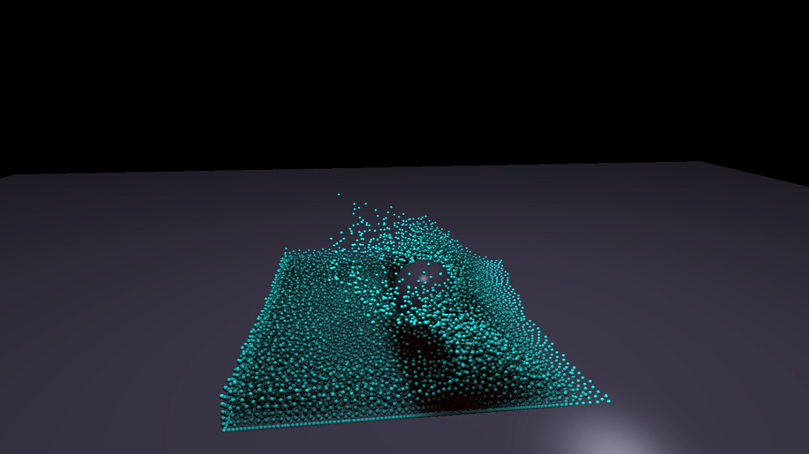
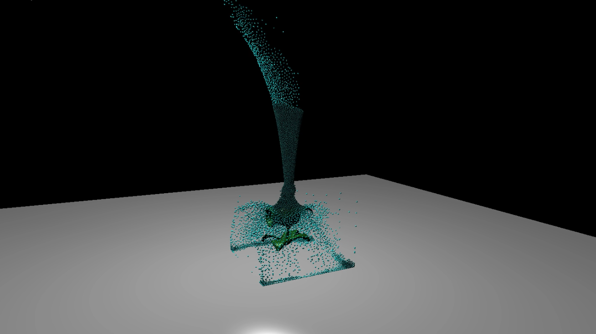

# PositionBasedFluids
### AUTHOR: 
Zachary Smeton
### DESCRIPTION:
Final project for Advanced Computer Graphics which utilizes OpenGL for rendering and GPGPU computations for fluid positions. The work is based on the paper “Position Based Fluids”, M. Macklin and M. Muller. I also implemented signed distance field collision detection for O(1) collision resolution with complex objects like the Plants V.S. Zombies pea shooter. This also used a compute shader to rapidly compute the hashed signed distance field texture.

